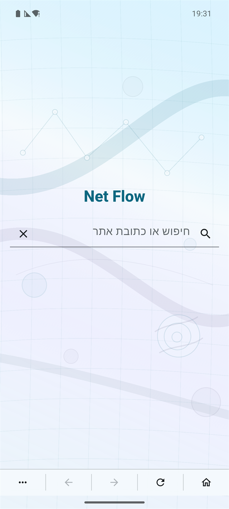

# Net Flow

Net Flow הוא דפדפן Android קומפקטי, בעברית, שנבנה לשימוש נוח במסכים קטנים ובסביבות גלישה מסוננות כמו Netfree.

הדפדפן מתמקד במינימום שטח ממשק ומקסימום שטח גלישה: שורת ניווט תחתונה דקה, דף בית נקי עם חיפוש מיידי, ותפריט פעולות קצר לפתיחת כתובת, סימניות והרשאות אתר.

<p align="center">
  
</p>

## יכולות עיקריות

- דף בית מינימליסטי עם שדה חיפוש/כתובת מיידי.
- חיפוש חופשי דרך Google, לצד זיהוי כתובות ואתרי אינטרנט.
- היסטוריית חיפושים מקומית עם הצעות מהירות.
- הצעות מתוך רשימת הסימניות בזמן הקלדה.
- סרגל תחתון קבוע לניווט: בית, רענון, קדימה, חזרה ותפריט.
- תפריט תחתון קומפקטי לסימניות, הרשאות ופתיחת כתובת.
- ממשק RTL עברי עם שדות טקסט שמתיישרים אוטומטית לפי שפת הקלט.
- הודעות ידידותיות למצבי חסימה, תקלות רשת ותגובות Netfree נפוצות.

## הורדה

אפשר להוריד APK מוכן מעמוד ה־[Releases](https://github.com/NHLOCAL/net_flow/releases).

## פיתוח מקומי

```bash
flutter pub get
flutter test
flutter build apk --debug
```

לבניית גרסת שחרור:

```bash
flutter build apk --release
```

## הערות

Net Flow נמצא בפיתוח פעיל. המטרה היא דפדפן קטן, מהיר ונוח לשימוש יומיומי, בלי עומס של טאבים, סרגלים ותפריטים קבועים שתופסים שטח מסך.
